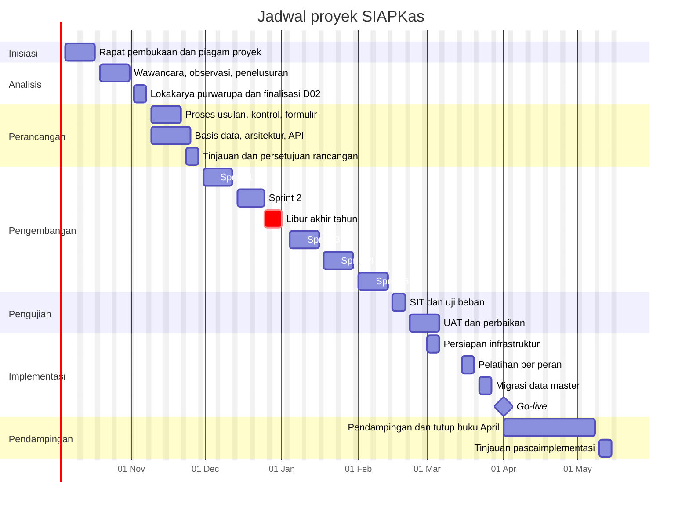
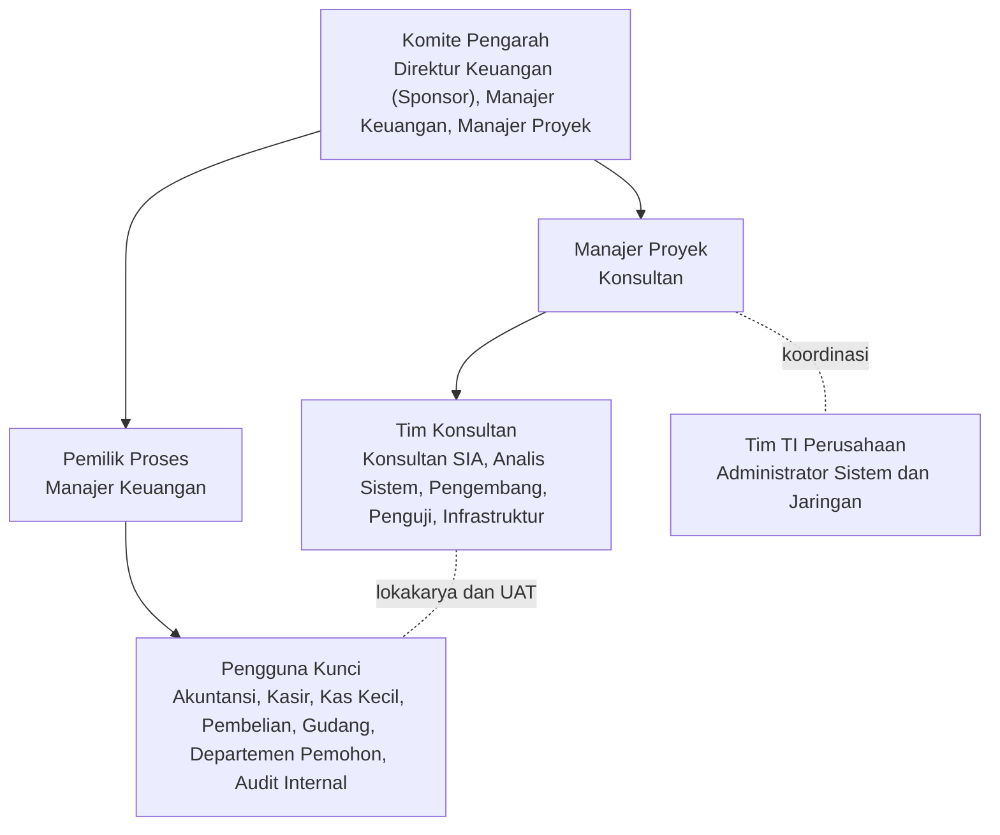

# Rencana proyek SIAPKas

Versi 1.0, 25 September 2026. Dokumen ini menjadi pegangan Manajer Proyek, Pemilik Proses, dan Komite Pengarah untuk mengendalikan jadwal, sumber daya, risiko, dan perubahan lingkup.

## 1. Status awal dan cara pakai purwarupa

Bersamaan dengan dokumen ini, konsultan menyerahkan rilis awal aplikasi (versi 1.0.0) di repositori yang sama. Rilis ini dibangun dari rancangan pada dokumen D02 sampai D09 dan sudah lulus uji otomatis. Rilis awal tidak menggantikan fase analisis. Rilis ini dipakai sebagai purwarupa fungsional: pengguna kunci mencoba alur nyata di layar sejak wawancara pertama, sehingga kebutuhan yang keliru terlihat lebih cepat daripada lewat dokumen saja. Fase pengembangan kemudian berisi penyesuaian hasil validasi, bukan membangun dari nol.

## 2. Metodologi

| Tahap | Pendekatan | Alasan |
|---|---|---|
| Inisiasi, analisis, perancangan | Berurutan dengan titik persetujuan (*sign-off*) di akhir tiap fase | Kontrol intern dan matriks otorisasi harus disepakati sebelum dikodekan |
| Pengembangan | Lima sprint dua mingguan, demo ke pengguna kunci setiap akhir sprint | Umpan balik cepat; perubahan kecil tidak menunggu akhir proyek |
| Pengujian | Uji integrasi sistem (SIT) oleh konsultan, lalu UAT oleh pengguna kunci | Pemisahan antara pembuat dan penguji |
| Implementasi | Peralihan langsung (*direct cutover*) di awal periode, dengan formulir manual cadangan selama 2 minggu | Menghindari jurnal ganda akibat operasi paralel penuh |

## 3. Fase, aktivitas, dan hasil kerja

### Fase 0: Inisiasi (5 sampai 16 Oktober 2026)

1. Rapat pembukaan bersama Sponsor, Pemilik Proses, pengguna kunci, dan tim TI.
2. Penyusunan piagam proyek: tujuan, lingkup, anggaran waktu, struktur organisasi proyek.
3. Pemetaan pemangku kepentingan dan penunjukan pengguna kunci per fungsi.
4. Pengumpulan dokumen awal: contoh formulir yang berlaku, bagan akun, kebijakan otorisasi, daftar rekening bank, daftar pemasok, stok buku cek dan bilyet giro, kebijakan kas kecil dan uang muka.

Hasil kerja: piagam proyek, daftar pemangku kepentingan, rencana proyek (dokumen ini).

### Fase 1: Analisis kebutuhan (19 Oktober sampai 6 November 2026)

1. Wawancara terstruktur dengan setiap fungsi (panduan di Lampiran A dokumen D02).
2. Observasi langsung proses pembayaran, kas kecil, dan rekonsiliasi bank selama minimal satu hari per fungsi.
3. Penelusuran sampel: 30 transaksi pembayaran terakhir ditelusuri dari permintaan sampai jurnal untuk menemukan titik lemah kontrol.
4. Pemetaan proses saat ini (*as-is*) dan daftar masalah.
5. Lokakarya kebutuhan dengan purwarupa: pengguna kunci mencoba alur di aplikasi dan mencatat ketidaksesuaian.
6. Finalisasi spesifikasi kebutuhan pengguna.

Hasil kerja: D02 Spesifikasi kebutuhan pengguna, D03 bagian proses saat ini.

### Fase 2: Perancangan (9 sampai 27 November 2026)

1. Rancangan proses usulan (*to-be*) dan prosedur.
2. Rancangan pengendalian intern: matriks pemisahan tugas, matriks otorisasi, matriks risiko dan kontrol.
3. Rancangan dokumen dan formulir beserta distribusi lembarnya.
4. Rancangan bagan akun dan jurnal otomatis.
5. Rancangan basis data, arsitektur, dan API.
6. Pemeriksaan kesiapan infrastruktur (server, jaringan, UPS, NAS).
7. Rapat tinjauan rancangan dan persetujuan.

Hasil kerja: D03 bagian proses usulan, D04 sampai D09.

### Fase 3: Pengembangan (30 November 2026 sampai 12 Februari 2027)

| Sprint | Tanggal | Isi |
|---|---|---|
| 1 | 30 Nov sampai 11 Des 2026 | Autentikasi, peran dan konflik peran, log audit, data master, penomoran dokumen |
| 2 | 14 Des sampai 24 Des 2026 | Pesanan pembelian, LPB/BAST, faktur pemasok, pencocokan tiga arah |
| Libur | 25 Des 2026 sampai 1 Jan 2027 | Tidak ada aktivitas proyek |
| 3 | 4 Jan sampai 15 Jan 2027 | BKK, persetujuan berjenjang, pembayaran, register cek, jurnal otomatis |
| 4 | 18 Jan sampai 29 Jan 2027 | Permintaan pembayaran, uang muka dan pertanggungjawaban, kas kecil |
| 5 | 1 Feb sampai 12 Feb 2027 | Rekonsiliasi bank, laporan, cetak formulir, aplikasi desktop |

Hasil kerja: kode sumber, uji otomatis, catatan rilis per sprint.

### Fase 4: Pengujian (15 Februari sampai 5 Maret 2027)

1. SIT oleh penguji konsultan: 15 sampai 19 Februari 2027.
2. Uji beban 80 sesi bersamaan dan uji keamanan dasar.
3. UAT oleh pengguna kunci memakai skenario D10: 22 Februari sampai 5 Maret 2027.
4. Perbaikan cacat dan uji ulang.

Hasil kerja: laporan SIT, berita acara UAT yang ditandatangani Pemilik Proses.

### Fase 5: Implementasi (1 sampai 31 Maret 2027)

1. Persiapan server, basis data, jadwal cadangan, dan instalasi aplikasi di PC pengguna: 1 sampai 5 Maret 2027.
2. Libur Idulfitri 1448 H: perkiraan pekan kedua Maret 2027; tanggal pasti mengikuti SKB cuti bersama.
3. Pelatihan per peran: 15 sampai 19 Maret 2027.
4. Migrasi data master (pemasok, akun, pengguna, buku cek): 22 sampai 26 Maret 2027.
5. Keputusan *go/no-go* oleh Komite Pengarah: 26 Maret 2027.
6. Input saldo awal per 31 Maret 2027 dan faktur yang belum lunas: 1 sampai 2 April 2027.

Hasil kerja: berita acara instalasi, materi dan daftar hadir pelatihan, berita acara migrasi saldo awal.

### Fase 6: Go-live dan pendampingan (1 April sampai 14 Mei 2027)

1. Go-live 1 April 2027.
2. Pendampingan di lokasi selama 2 minggu pertama, lalu jarak jauh.
3. Pendampingan tutup buku bulan pertama (April 2027).
4. Tinjauan pascaimplementasi (*post-implementation review*) dan serah terima ke tim TI Perusahaan.

Hasil kerja: laporan pendampingan, laporan tinjauan pascaimplementasi, berita acara serah terima.

## 4. Jadwal

| Kode | Tonggak (*milestone*) | Tanggal target | Penyetuju |
|---|---|---|---|
| M1 | Piagam proyek disetujui | 16 Okt 2026 | Sponsor |
| M2 | D02 dan proses saat ini disetujui | 6 Nov 2026 | Pemilik Proses |
| M3 | Rancangan D03 sampai D09 disetujui | 27 Nov 2026 | Pemilik Proses dan Kepala TI |
| M4 | Rilis fitur lengkap (akhir sprint 5) | 12 Feb 2027 | Manajer Proyek |
| M5 | SIT selesai | 19 Feb 2027 | Manajer Proyek |
| M6 | UAT disetujui | 5 Mar 2027 | Pemilik Proses |
| M7 | Pelatihan selesai | 19 Mar 2027 | Pemilik Proses |
| M8 | Keputusan *go/no-go* | 26 Mar 2027 | Komite Pengarah |
| M9 | Go-live | 1 Apr 2027 | Sponsor |
| M10 | Tutup buku April selesai di sistem | 7 Mei 2027 | Pemilik Proses |
| M11 | Serah terima dan tinjauan pascaimplementasi | 14 Mei 2027 | Sponsor |

Total durasi 32 minggu: 26 minggu sampai go-live, ditambah 6 minggu pendampingan dan serah terima.

## 5. Organisasi proyek

### Matriks RACI

R = pelaksana, A = penanggung jawab akhir (menyetujui), C = dimintai pendapat, I = diberi informasi.

| Aktivitas | Sponsor | Pemilik Proses | Pengguna Kunci | TI Perusahaan | Manajer Proyek | Konsultan SIA | Analis Sistem | Pengembang | Penguji |
|---|---|---|---|---|---|---|---|---|---|
| Piagam proyek | A | C | I | I | R | C | I | I | I |
| Wawancara dan observasi | I | C | C | C | A | R | C | I | I |
| Spesifikasi kebutuhan (D02) | I | A | C | C | C | R | C | I | C |
| Proses, kontrol, formulir (D03 sampai D05) | I | A | C | I | C | R | C | I | I |
| Akuntansi (D07) | I | A | C | I | C | R | C | I | I |
| Basis data, arsitektur, API (D06, D08, D09) | I | I | I | C | A | C | R | C | I |
| Pengembangan | I | I | C | I | A | C | C | R | C |
| SIT | I | I | I | I | A | C | C | C | R |
| UAT | I | A | R | I | C | C | I | C | C |
| Infrastruktur server dan jaringan | I | I | I | R | A | I | C | C | I |
| Migrasi data | I | A | R | C | C | C | C | R | C |
| Pelatihan | I | A | C | C | C | R | I | C | I |
| Keputusan *go/no-go* | A | R | C | C | R | C | I | I | C |
| Pendampingan pasca go-live | I | A | C | C | R | R | C | R | I |

## 6. Estimasi usaha

Estimasi dalam hari-orang (HO) tim konsultan. PM = Manajer Proyek, KS = Konsultan SIA, AS = Analis Sistem, BE = pengembang *backend* (2 orang), FE = pengembang *frontend* dan desktop (2 orang), QA = penguji, INF = spesialis infrastruktur.

| Fase | PM | KS | AS | BE | FE | QA | INF | Total |
|---|---|---|---|---|---|---|---|---|
| 0 Inisiasi | 5 | 5 | 0 | 0 | 0 | 0 | 0 | 10 |
| 1 Analisis | 5 | 15 | 8 | 0 | 0 | 0 | 0 | 28 |
| 2 Perancangan | 5 | 12 | 15 | 5 | 5 | 0 | 0 | 42 |
| 3 Pengembangan | 12 | 10 | 10 | 100 | 100 | 25 | 0 | 257 |
| 4 Pengujian | 5 | 10 | 0 | 10 | 10 | 15 | 0 | 50 |
| 5 Implementasi | 5 | 12 | 0 | 5 | 0 | 0 | 8 | 30 |
| 6 Pendampingan | 4 | 8 | 0 | 8 | 4 | 0 | 2 | 26 |
| Total | 41 | 72 | 33 | 128 | 119 | 40 | 10 | 443 |

Keterlibatan pihak Perusahaan: pengguna kunci dialokasikan 20% waktu kerja selama analisis dan perancangan, 50% selama UAT, dan penuh selama 1 hari pelatihan per peran. Tim TI Perusahaan dialokasikan 2 orang selama Fase 5.

## 7. Rencana komunikasi

| Forum | Peserta | Frekuensi | Tujuan | Keluaran |
|---|---|---|---|---|
| Rapat pembukaan | Semua pemangku kepentingan | Sekali, minggu 1 | Menyepakati lingkup, jadwal, peran | Notulen, piagam proyek |
| Rapat proyek mingguan | PM, Pemilik Proses, KS, perwakilan TI | Setiap Senin 10.00 WIB | Progres, isu, risiko | Laporan status mingguan |
| Demo akhir sprint | Pengguna kunci, Pemilik Proses, tim konsultan | Jumat terakhir tiap sprint | Umpan balik fitur | Catatan umpan balik, perubahan *backlog* |
| Komite Pengarah | Sponsor, Pemilik Proses, PM | Bulanan, minggu pertama | Keputusan lingkup, jadwal, risiko tinggi | Risalah keputusan |
| Laporan status tertulis | PM kepada Sponsor dan Pemilik Proses | Mingguan, Senin sore | Ringkasan progres terhadap tonggak | Laporan 1 halaman |
| Papan isu | Seluruh tim | Terus-menerus | Mencatat cacat, pertanyaan, permintaan perubahan | Daftar isu di repositori |

## 8. Register risiko

Tingkat: T = tinggi, S = sedang, R = rendah.

| ID | Risiko | Kemungkinan | Dampak | Mitigasi | Pemilik |
|---|---|---|---|---|---|
| R01 | Pengguna kunci tidak tersedia karena beban tutup buku | T | T | Wawancara dan UAT dijadwalkan di luar tanggal 1 sampai 7 setiap bulan; Sponsor menerbitkan memo alokasi waktu | Sponsor |
| R02 | Permintaan tambahan lingkup (misalnya modul persediaan) | T | S | Prosedur pengendalian perubahan (bagian 9); permintaan di luar lingkup masuk daftar Fase 2 | PM |
| R03 | Data master pemasok dan rekening banknya tidak bersih | S | T | Pembersihan data mulai Fase 2; setiap rekening pemasok diverifikasi Kepala Bagian Akuntansi sebelum go-live | Pemilik Proses |
| R04 | Jumlah staf keuangan tidak cukup untuk pemisahan tugas penuh | S | T | Kontrol kompensasi: tinjauan atasan dan laporan pengecualian bulanan kepada Audit Internal | Pemilik Proses |
| R05 | Pengguna menolak perubahan dari formulir kertas | S | S | Pengguna kunci dilibatkan sejak analisis; pelatihan per peran; satu *champion* di tiap departemen | Sponsor |
| R06 | Server, UPS, atau NAS belum tersedia tepat waktu | S | T | Spesifikasi diserahkan di Fase 2; pengadaan paling lambat 15 Januari 2027 | TI Perusahaan |
| R07 | Libur akhir tahun dan Idulfitri memotong jadwal | T | S | Sudah dimasukkan ke jadwal; cadangan waktu 1 minggu sebelum go-live | PM |
| R08 | Penyalahgunaan hak akses | R | T | Hak akses berbasis peran, konflik peran diblokir, log audit, tinjauan akses setiap triwulan | TI Perusahaan |
| R09 | Kehilangan data akibat kerusakan perangkat keras | R | T | RAID 1 pada server, cadangan harian ke NAS, uji pemulihan setiap triwulan | TI Perusahaan |
| R10 | Saldo awal tidak cocok dengan buku besar lama | S | T | Rekonsiliasi saldo awal dan berita acara migrasi ditandatangani Pemilik Proses sebelum transaksi pertama | Pemilik Proses |
| R11 | Tarif PPN atau PPh berubah | S | S | Tarif disimpan di master pajak dan dapat diubah tanpa mengubah kode | Konsultan SIA |
| R12 | Kinerja turun saat puncak akhir bulan | R | S | Uji beban 80 sesi pada SIT; indeks basis data; pemantauan pada pendampingan | Analis Sistem |

## 9. Pengendalian perubahan

1. Pengusul mengisi Formulir Permintaan Perubahan: uraian, alasan bisnis, urgensi, dan dokumen terdampak.
2. Konsultan SIA dan Analis Sistem menilai dampak terhadap lingkup, jadwal, usaha, dan kontrol intern dalam 3 hari kerja.
3. Perubahan dengan dampak paling banyak 3 hari-orang dan tidak mengubah kontrol intern diputuskan Pemilik Proses. Perubahan lain diputuskan Komite Pengarah.
4. Setiap keputusan dicatat di log perubahan, lalu dokumen terdampak diperbarui dan nomor versinya dinaikkan.
5. Perubahan pada matriks otorisasi atau matriks konflik peran setelah go-live hanya boleh dilakukan Administrator atas permintaan tertulis Direktur Keuangan, dan tercatat di log audit.

## 10. Manajemen mutu

Sebuah fitur dinyatakan selesai jika:

1. memenuhi kriteria penerimaan pada D02;
2. setiap aturan bisnis terkait punya uji otomatis yang lulus;
3. sudah ditinjau oleh pengembang lain;
4. tidak menyisakan cacat berkategori kritis atau tinggi;
5. manual pengguna dan SOP terkait sudah diperbarui.

Kriteria penerimaan hasil kerja:

| Hasil kerja | Kriteria diterima |
|---|---|
| Dokumen D01 sampai D14 | Ditinjau dan ditandatangani penyetuju pada tabel tonggak |
| Aplikasi | 100% skenario UAT berprioritas Wajib lulus; tidak ada cacat kritis atau tinggi yang terbuka; paling banyak 5 cacat sedang dan masing-masing punya cara kerja alternatif |
| Migrasi data | Saldo awal di sistem sama dengan neraca saldo sistem lama per 31 Maret 2027, selisih Rp0 |
| Pelatihan | Minimal 90% pengguna terdaftar hadir; setiap peserta menyelesaikan latihan praktik peran masing-masing |

## 11. Asumsi dan ketergantungan

1. Perusahaan menyediakan satu server aplikasi dan satu server basis data (atau satu server gabungan) sesuai spesifikasi D14 paling lambat 15 Januari 2027.
2. Seluruh PC klien memakai Windows 10 atau 11 64-bit dan terhubung ke LAN 1 Gbps.
3. Bagan akun dan kebijakan otorisasi Perusahaan tersedia dalam bentuk tertulis pada Fase 0.
4. Volume transaksi mengikuti asumsi di D02 bagian 2.3; kenaikan di atas 50% dilaporkan ke Komite Pengarah karena memengaruhi spesifikasi server.
5. Perusahaan tetap memakai perangkat lunak akuntansi lama untuk modul di luar lingkup sampai fase berikutnya. Jurnal dari SIAPKas dapat diekspor ke CSV untuk dimasukkan ke sistem lama.

## 12. Persetujuan dokumen

| Peran | Nama | Tanda tangan | Tanggal |
|---|---|---|---|
| Sponsor (Direktur Keuangan) | | | |
| Pemilik Proses (Manajer Keuangan) | | | |
| Manajer Proyek (Konsultan) | | | |
