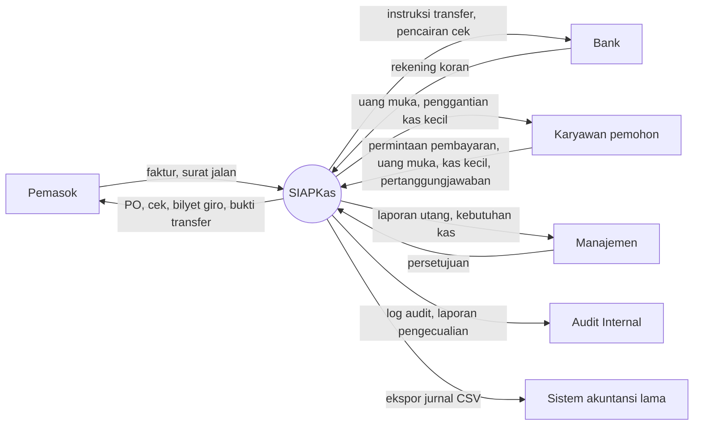
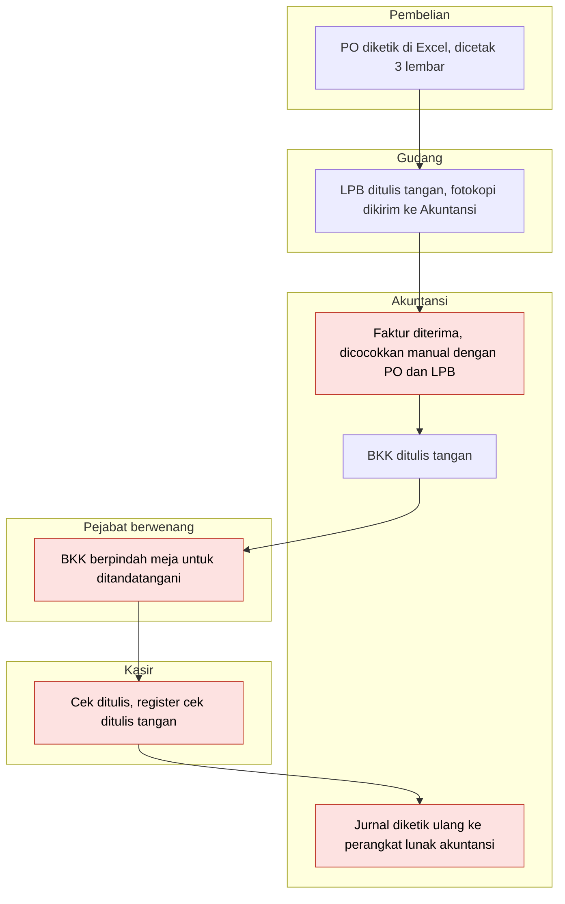
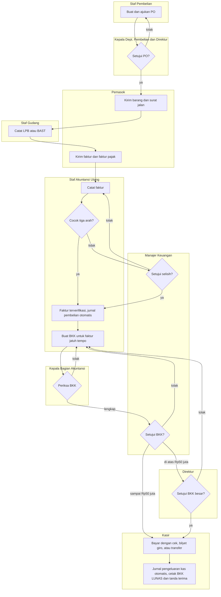
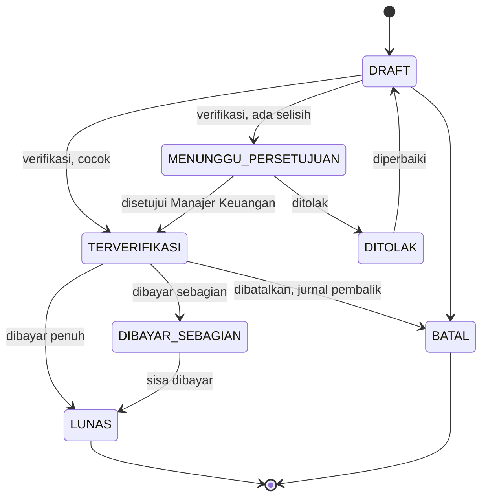
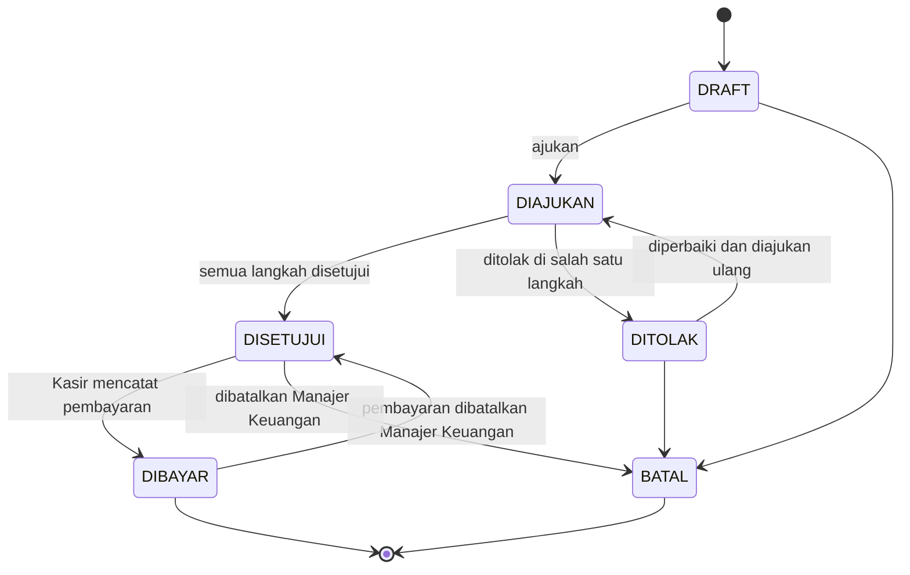
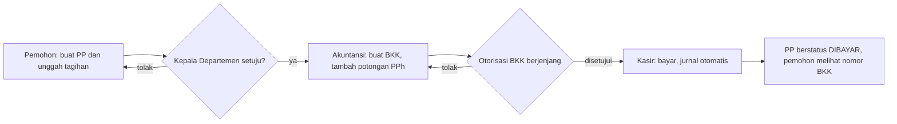
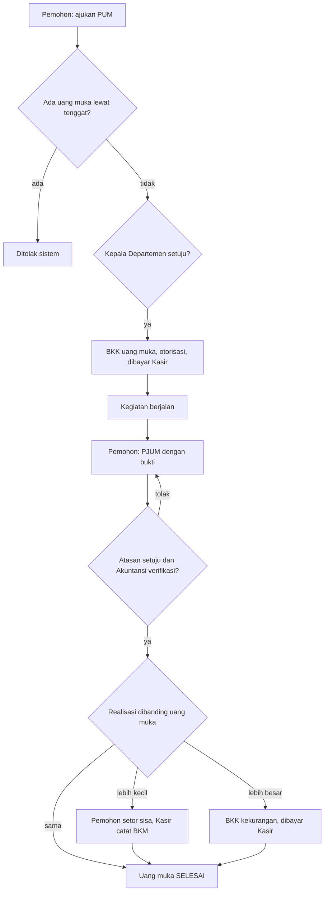
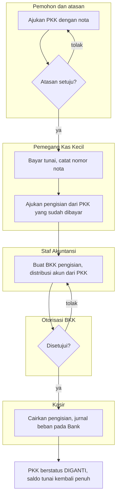
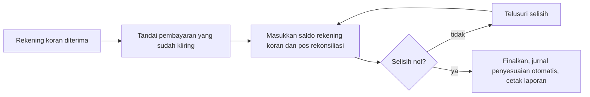

# Analisis dan rancangan proses bisnis

Versi 1.0, 25 September 2026. Dokumen ini memetakan proses pengeluaran kas saat ini, lalu merancang proses usulan yang dijalankan SIAPKas. Setiap proses usulan diuraikan menurut fungsi yang terkait, dokumen, catatan akuntansi, dan jaringan prosedurnya.

## 1. Diagram konteks

## 2. Proses saat ini

Alur di bawah menggambarkan pembayaran utang pemasok sebelum SIAPKas. Kotak merah menandai titik lemah yang menjadi masalah M-01 sampai M-09 di dokumen D02.

| Langkah | Kelemahan | Masalah |
|---|---|---|
| Pencocokan manual | Faktur ganda atau barang belum diterima bisa lolos | M-01 |
| BKK berpindah meja | Rata-rata 9 hari kerja; berkas bisa tertahan saat pejabat dinas luar | M-02 |
| Tidak ada daftar jatuh tempo | Denda dan potongan tunai hilang | M-03 |
| Register cek tulis tangan | Lembar batal tidak tercatat | M-04 |
| Jurnal diketik ulang | Input ganda, salah ketik | M-08 |
| Tidak ada log | Perubahan data tidak tertelusur | M-09 |

## 3. Prinsip rancangan proses usulan

1. **Satu pintu keluar kas.** Uang hanya keluar dari rekening bank atas dasar BKK yang disetujui lengkap. Pengecualiannya pengeluaran kecil dari dana kas kecil, yang dikendalikan dengan sistem imprest.
2. **Tiga fungsi terpisah.** Fungsi yang mencatat (Akuntansi), fungsi yang menyimpan kas (Kasir dan Pemegang Kas Kecil), dan fungsi yang mengotorisasi (Kepala Departemen, Manajer Keuangan, Direktur) dipegang orang berbeda.
3. **Dokumen elektronik bernomor urut.** Setiap dokumen bernomor sistem sejak dibuat dan tidak pernah dihapus.
4. **Jurnal tercipta dari transaksi.** Tidak ada pengetikan ulang jurnal.

## 4. Proses usulan A: pembayaran utang pemasok (sistem voucher)

### 4.1 Fungsi yang terkait

| Fungsi | Pelaksana | Tugas |
|---|---|---|
| Pembelian | Staf Pembelian | Membuat PO dan memelihara data pemasok |
| Otorisasi pembelian | Kepala Departemen Pembelian, Direktur | Menyetujui PO sesuai nilai |
| Penerimaan | Staf Gudang | Mencatat LPB atau BAST |
| Pencatat utang | Staf Akuntansi Utang | Mencatat faktur, membuat BKK |
| Otorisasi pembayaran | Kepala Bagian Akuntansi, Manajer Keuangan, Direktur | Memeriksa dan menyetujui BKK |
| Kas | Kasir | Membayar, mengelola warkat |

### 4.2 Dokumen

PO, LPB atau BAST, faktur pemasok dan faktur pajak (dari pemasok), BKK, cek atau bilyet giro atau bukti transfer, tanda terima cek, instruksi transfer.

### 4.3 Catatan akuntansi

Register faktur (jurnal pembelian), register BKK, register cek, jurnal pengeluaran kas, buku pembantu utang, buku besar.

### 4.4 Jaringan prosedur

1. **Prosedur pemesanan.** Staf Pembelian membuat PO dan mengajukannya. Kepala Departemen Pembelian menyetujui; PO di atas Rp100.000.000 juga disetujui Direktur. PO yang disetujui dicetak dan dikirim ke pemasok.
2. **Prosedur penerimaan.** Staf Gudang mencatat LPB (barang) atau BAST (jasa) terhadap PO. Sistem menolak kuantitas yang melebihi sisa pesanan dan memperbarui status PO.
3. **Prosedur pencatatan utang.** Staf Akuntansi mencatat faktur. Sistem memeriksa nomor ganda, lalu mencocokkan faktur dengan PO dan LPB per baris. Faktur cocok langsung terverifikasi dan jurnal pembelian terbentuk. Faktur berselisih masuk kotak persetujuan Manajer Keuangan.
4. **Prosedur pembuatan BKK.** Menjelang jatuh tempo, Staf Akuntansi membuat BKK untuk satu pemasok, memilih satu atau beberapa faktur, serta menentukan rekening sumber dan metode bayar.
5. **Prosedur otorisasi BKK.** Kepala Bagian Akuntansi memeriksa kelengkapan, Manajer Keuangan menyetujui, dan Direktur menyetujui BKK di atas Rp50.000.000.
6. **Prosedur pembayaran.** Kasir membayar dari antrean. Untuk cek atau bilyet giro, sistem mengusulkan nomor lembar berikutnya; untuk transfer, Kasir mencatat nomor referensi dari internet banking. Jurnal pengeluaran kas terbentuk, faktur berkurang sisanya, dan BKK bercap LUNAS.
7. **Prosedur penyerahan.** Pemasok menandatangani tanda terima cek. Salinan BKK berfungsi sebagai pemberitahuan pembayaran (*remittance advice*).

### 4.5 Diagram alir

### 4.6 Siklus status faktur

### 4.7 Siklus status BKK

## 5. Proses usulan B: permintaan pembayaran nonpembelian

Dipakai untuk pengeluaran yang tidak melalui PO: tagihan listrik, air, telepon, sewa, jasa profesional, langganan, iuran, dan penggantian biaya.

| Fungsi | Pelaksana | Tugas |
|---|---|---|
| Fungsi yang memerlukan pembayaran | Pemohon | Membuat PP dan melampirkan tagihan |
| Otorisasi departemen | Kepala Departemen (atau Direktur bila pemohonnya Kepala Departemen) | Menyetujui PP |
| Pencatat | Staf Akuntansi Utang | Membuat BKK, menambahkan potongan PPh |
| Otorisasi pembayaran dan kas | Sama dengan proses A | |

Jaringan prosedur:

1. Pemohon membuat PP, mengunggah tagihan, lalu mengajukan.
2. Kepala Departemen menyetujui atau menolak dengan alasan.
3. Staf Akuntansi membuat BKK dari PP, mengoreksi akun bila perlu, dan menambahkan potongan PPh Pasal 23 atau Pasal 4 ayat (2). Total yang disetujui tidak dapat diubah.
4. Otorisasi BKK dan pembayaran sama dengan proses A langkah 5 sampai 7. Jurnal saat dibayar: beban pada akun masing-masing, utang pajak sebesar potongan, dan bank sebesar jumlah dibayar.

## 6. Proses usulan C: uang muka kerja dan pertanggungjawaban

| Fungsi | Pelaksana | Tugas |
|---|---|---|
| Pemohon | Karyawan | Mengajukan PUM dan PJUM |
| Otorisasi | Kepala Departemen | Menyetujui PUM dan PJUM |
| Verifikasi | Kepala Bagian Akuntansi | Memeriksa bukti PJUM |
| Pencatat | Staf Akuntansi Utang | Membuat BKK uang muka dan BKK kekurangan |
| Kas | Kasir | Membayar, menerima pengembalian sisa (BKM) |

Jaringan prosedur:

1. Pemohon mengajukan PUM dengan tanggal kegiatan selesai. Sistem menolak bila pemohon masih punya uang muka yang lewat tenggat.
2. Kepala Departemen menyetujui. Staf Akuntansi membuat BKK uang muka, lalu setelah otorisasi Kasir membayar. Jurnal: Uang Muka Karyawan pada Bank.
3. Paling lambat 7 hari setelah kegiatan selesai, pemohon membuat PJUM dengan rincian realisasi dan bukti.
4. Kepala Departemen menyetujui dan Kepala Bagian Akuntansi memverifikasi. Sistem membentuk jurnal penyelesaian: beban realisasi pada Uang Muka Karyawan.
5. Bila realisasi lebih kecil, selisihnya menjadi Piutang Karyawan dan pemohon menyetor sisa ke Kasir, yang mencatat BKM. Bila realisasi lebih besar, selisihnya menjadi Utang kepada Karyawan dan dibayar melalui BKK kekurangan. Bila sama, uang muka langsung selesai.

## 7. Proses usulan D: dana kas kecil (sistem imprest)

| Fungsi | Pelaksana | Tugas |
|---|---|---|
| Pemohon | Karyawan | Mengajukan pengeluaran kas kecil (PKK) |
| Otorisasi | Kepala Departemen | Menyetujui PKK |
| Pemegang dana | Pemegang Kas Kecil | Membayar PKK, menyimpan uang tunai di brankas, mengajukan pengisian kembali |
| Pencatat | Staf Akuntansi Utang | Memproses pengisian menjadi BKK |
| Kas | Kasir | Mencairkan pembentukan dan pengisian dana |
| Pemeriksa | Auditor Internal atau Kepala Bagian Akuntansi | Opname mendadak |

Jaringan prosedur:

1. **Pembentukan dana.** Manajer Keuangan mendaftarkan dana beserta pemegang dan batas per transaksi. Staf Akuntansi membuat BKK pembentukan. Setelah dibayar, dana aktif. Jurnal: Kas Kecil pada Bank.
2. **Pengeluaran dana.** Pemohon mengajukan PKK dan melampirkan nota. Setelah disetujui atasan, Pemegang Kas Kecil membayar tunai dan mencatat nomor nota. Tidak ada jurnal pada langkah ini.
3. **Pengisian kembali.** Pemegang Kas Kecil memilih PKK yang sudah dibayar dan mengajukan pengisian. Staf Akuntansi membuat BKK pengisian; distribusi akunnya diambil dari PKK. Setelah dibayar, jurnal: beban-beban pada Bank, dan PKK berstatus diganti.
4. **Opname.** Pemeriksa menghitung uang tunai per pecahan. Uang tunai ditambah bukti yang belum diganti harus sama dengan dana tetap. Selisih dilaporkan ke Manajer Keuangan dan diselesaikan dengan jurnal manual.

## 8. Proses usulan E: pembatalan pembayaran dan warkat

1. Kasir menemukan cek salah tulis atau rusak sebelum diserahkan, atau pemasok mengembalikan cek.
2. Bila lembar warkat belum dipakai pembayaran, Kasir membatalkan lembar itu dengan alasan. Fisik cek yang dibatalkan disimpan dan dicoret BATAL.
3. Bila lembar sudah dipakai pembayaran, Manajer Keuangan membatalkan pembayaran dengan alasan. Sistem membuat jurnal pembalik bertanggal hari pembatalan, menandai warkat batal, memulihkan sisa utang, dan mengembalikan BKK ke antrean Kasir. Bila pembayaran memang tidak akan dilakukan, Manajer Keuangan sekaligus membatalkan BKK-nya.
4. Laporan pengecualian bulanan mencantumkan setiap pembatalan untuk diperiksa Audit Internal.

## 9. Proses usulan F: rekonsiliasi bank

1. Setelah rekening koran bulan berjalan diterima, Kepala Bagian Akuntansi membuat rekonsiliasi untuk rekening dan bulan tersebut.
2. Sistem menampilkan pembayaran yang belum kliring per akhir bulan. Pembayaran yang tercantum di rekening koran ditandai kliring beserta tanggalnya.
3. Kepala Bagian Akuntansi memasukkan saldo rekening koran dan pos lain: setoran dalam perjalanan, biaya administrasi bank, jasa giro, dan koreksi.
4. Sistem menghitung saldo bank disesuaikan dan saldo buku disesuaikan. Bila selisihnya nol, rekonsiliasi dapat difinalkan dan pos sisi buku dijurnal otomatis.
5. Laporan rekonsiliasi dicetak, ditandatangani Kepala Bagian Akuntansi, dan diketahui Manajer Keuangan.

## 10. Proses usulan G: tutup buku bulanan

| Hari kerja setelah akhir bulan | Kegiatan | Pelaksana |
|---|---|---|
| 1 | Memastikan semua pembayaran bulan lalu sudah dicatat | Kasir |
| 1 s.d. 2 | Memproses pengisian kas kecil yang masih terbuka dan faktur yang masih draf | Pemegang Kas Kecil, Staf Akuntansi |
| 1 s.d. 3 | Rekonsiliasi bank setiap rekening | Kepala Bagian Akuntansi |
| 3 | Mencocokkan daftar saldo utang dengan akun Utang Usaha | Kepala Bagian Akuntansi |
| 4 | Meninjau neraca saldo dan laporan pengecualian | Manajer Keuangan |
| 5 | Menutup periode di sistem | Manajer Keuangan |

## 11. Perbandingan proses saat ini dan usulan

| Aktivitas | Saat ini | Usulan | Dampak |
|---|---|---|---|
| Pencocokan faktur | Manual, tiga berkas | Otomatis per baris saat faktur dicatat | Faktur ganda dan kuantitas lebih tertolak sistem |
| Persetujuan | Berkas fisik berpindah meja | Kotak persetujuan elektronik, jenjang sesuai nilai | Target maksimal 3 hari kerja |
| Jatuh tempo | Tidak terpantau | Laporan faktur jatuh tempo dan umur utang | Pembayaran tepat waktu |
| Nomor cek | Register tulis tangan | Setiap lembar tercatat sejak buku cek diterima | Lembar hilang atau batal terlihat |
| Kas kecil | Bukti kertas, pengisian lambat | Bukti tercatat saat dibayar, pengisian dari data yang ada | Saldo tunai selalu terlihat |
| Uang muka | Tanpa daftar umur | Tenggat otomatis, pengajuan baru diblokir bila lewat tenggat | Uang muka beredar terkendali |
| Rekonsiliasi | Daftar cek beredar disusun manual | Daftar otomatis, tinggal menandai kliring | Target maksimal 3 hari kerja |
| Jurnal | Diketik ulang | Terbentuk otomatis | Input ganda hilang |
| Jejak audit | Tidak ada | Log audit setiap perubahan | Penelusuran dan pencegahan kecurangan |
