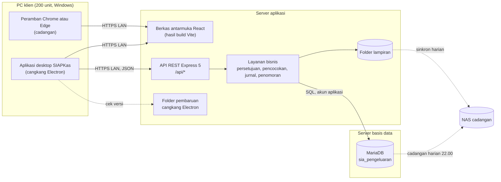
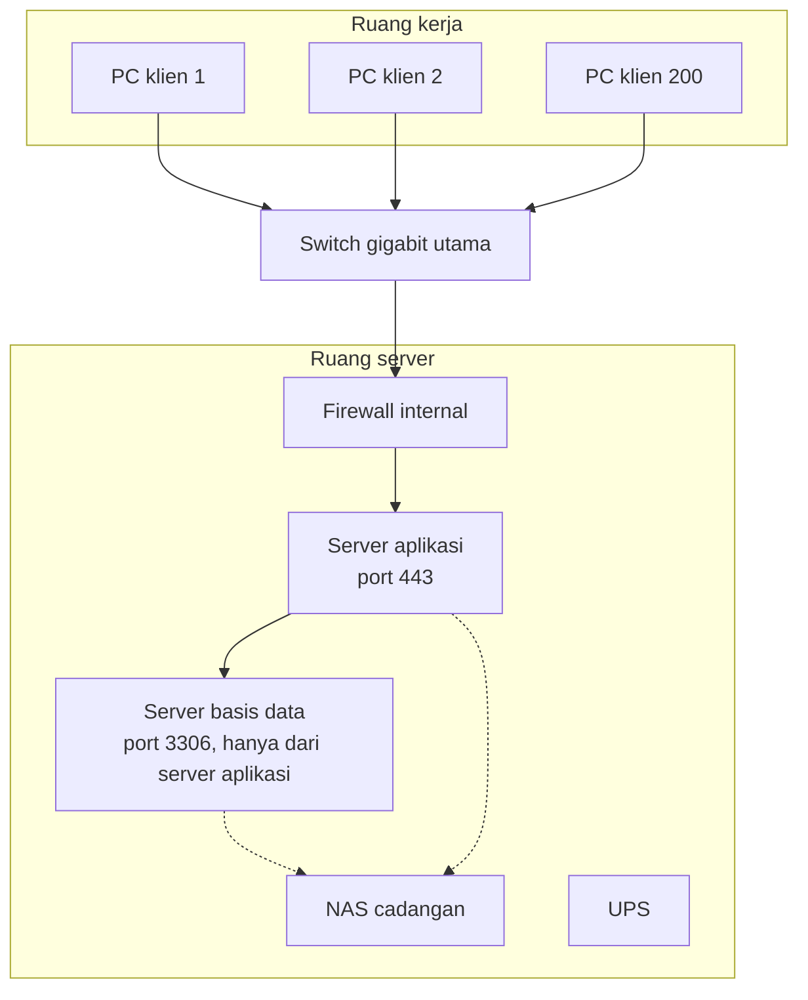

# Arsitektur sistem (SAD v2.0)

Versi 2.0, 25 September 2026. Dokumen ini melanjutkan SAD v1.1 (`../gemini-code-1790339611374.md`). Arah dasarnya tetap: aplikasi desktop di 200 PC klien, satu server aplikasi Node.js yang menjadi satu-satunya jalur ke basis data, MariaDB sebagai basis data, seluruhnya di LAN tanpa internet, dan cadangan harian ke NAS. Versi 2.0 menambahkan keputusan rinci yang diperlukan untuk membangun dan mengoperasikan SIAPKas.

## 1. Perubahan terhadap SAD v1.1

| Butir | SAD v1.1 | SAD v2.0 |
|---|---|---|
| Kerangka antarmuka | Electron dengan React atau Vue | Electron sebagai *thin client*; antarmuka React 19 dibangun dengan Vite dan disajikan server aplikasi |
| Kerangka server | Express atau NestJS | Express 5 di Node.js 24 LTS (minimal Node.js 22) |
| Basis data | MariaDB | MariaDB LTS (10.11 atau 11.4), InnoDB, `utf8mb4`, zona waktu +07:00 |
| Pembaruan klien | Auto-updater dari server lokal | Antarmuka selalu dimuat dari server sehingga otomatis mutakhir; *auto-updater* hanya untuk cangkang Electron |
| Keamanan | Sesi dan pencegahan akses langsung ke basis data | Ditambah hak akses per peran, konflik peran, kunci akun, batas waktu sesi, log audit, dan HTTPS di LAN |

## 2. Catatan keputusan arsitektur

| No | Keputusan | Alternatif yang ditolak | Alasan |
|---|---|---|---|
| ADR-01 | Electron memuat antarmuka dari URL server aplikasi | Antarmuka dibundel di setiap instalasi Electron | Dengan 200 PC, antarmuka yang dibundel berarti 200 pembaruan per rilis dan risiko versi campur. Memuat dari server membuat semua klien memakai versi yang sama sejak dibuka ulang |
| ADR-02 | Express 5 | NestJS | Modul SIAPKas sederhana dan berorientasi transaksi SQL; Express lebih ringan untuk tim pemelihara internal. Express 5 meneruskan galat dari fungsi `async` secara bawaan |
| ADR-03 | React dengan Vite | Vue | Ekosistem komponen tabel dan formulir lebih luas; tim pemelihara lebih mudah direkrut |
| ADR-04 | SQL eksplisit dengan `mysql2` dan berkas migrasi bernomor | ORM | Transaksi keuangan butuh kendali penuh atas penguncian baris (`SELECT ... FOR UPDATE`) dan urutan kueri; administrator dapat membaca skema langsung di Navicat |
| ADR-05 | Token sesi acak yang di-hash dan disimpan di basis data | JWT tanpa status | Sesi dapat dicabut seketika (keluar, akun dinonaktifkan) dan batas waktu tanpa aktivitas dapat ditegakkan |
| ADR-06 | Hash kata sandi scrypt bawaan Node.js | bcrypt dengan modul native | Tanpa kompilasi modul native di server Windows maupun Linux |
| ADR-07 | Nilai uang `DECIMAL(18,2)` di basis data; perhitungan di server dalam satuan sen (bilangan bulat) | Bilangan pecahan biasa | Menghindari galat pembulatan pada total jurnal |
| ADR-08 | Formulir dicetak dari halaman HTML dengan CSS cetak (A4) melalui fitur cetak Electron atau peramban | PDF dibuat di server | Tata letak mudah diubah, pratinjau langsung, dan Electron dapat menyimpan ke PDF tanpa pustaka tambahan |
| ADR-09 | Lampiran disimpan di sistem berkas server, metadata di basis data | Lampiran sebagai BLOB di basis data | Cadangan basis data tetap kecil; berkas lampiran dicadangkan terpisah secara inkremental |
| ADR-10 | Nomor dokumen dari tabel `penomoran` yang dikunci per baris | `AUTO_INCREMENT` atau hitung `MAX()+1` | Menjamin nomor berurutan tanpa ganda walau disimpan bersamaan, dengan urutan per kode per bulan |

## 3. Komponen



## 4. Topologi LAN



Aturan jaringan:

1. PC klien hanya dapat menjangkau port 443 (atau 3000 pada tahap uji) di server aplikasi.
2. Port 3306 MariaDB hanya menerima koneksi dari server aplikasi dan dari PC administrator basis data yang terdaftar (untuk Navicat).
3. Server aplikasi dan basis data boleh digabung dalam satu mesin untuk tahap awal; aturan akses tetap sama.

## 5. Struktur perangkat lunak

```
feb_accounting_is/
  server/                   API dan logika bisnis
    src/app.js              susunan middleware dan rute
    src/lib/                uang, penomoran, jurnal, persetujuan, log audit, periode
    src/modules/            satu folder per modul: auth, admin, master, pembelian,
                            utang, permintaan, uangmuka, kaskecil, bkk, pembayaran,
                            kasmasuk, rekonsiliasi, akuntansi, laporan, persetujuan,
                            lampiran, dasbor
    db/migrations/          berkas SQL bernomor (skema dan data awal)
    db/migrate.js           penjalan migrasi
    db/demo.js              data contoh untuk pelatihan
    test/                   uji integrasi terhadap basis data uji
  client/                   antarmuka React (Vite)
    src/pages/              layar per modul
    src/print/              templat formulir cetak
    src/components/         komponen bersama (tabel, formulir, panel persetujuan)
  desktop/                  cangkang Electron dan konfigurasi electron-builder
  docs/                     dokumen proyek D00 sampai D14
```

Server tersusun tiga lapis. Lapisan rute memeriksa sesi, peran, dan validasi masukan (zod). Lapisan layanan menjalankan aturan bisnis di dalam satu transaksi basis data. Lapisan data memakai kueri berparameter `mysql2`, sehingga tidak ada nilai masukan yang disambung langsung ke teks SQL.

## 6. Keamanan

| Area | Rancangan |
|---|---|
| Autentikasi | Nama pengguna dan kata sandi; hash scrypt dengan garam acak 16 byte; kunci 15 menit setelah 5 kali gagal; wajib ganti kata sandi awal |
| Sesi | Token acak 32 byte dikirim di header `Authorization: Bearer`; yang disimpan di basis data hanya hash SHA-256-nya; berakhir setelah 30 menit tanpa aktivitas atau 12 jam sejak masuk; dicabut saat keluar atau akun dinonaktifkan |
| Otorisasi | Setiap rute menyatakan peran yang boleh mengaksesnya. Data dokumen disaring per pengguna: Pemohon melihat miliknya, Kepala Departemen melihat departemennya, peran keuangan dan Auditor melihat semua |
| Pemisahan tugas | Konflik peran diperiksa saat peran diberikan; *maker-checker* dan satu-orang-satu-langkah diperiksa di mesin persetujuan; Kasir tidak dapat membayar BKK yang ia buat atau setujui |
| Log audit | Tabel `log_audit` hanya ditambah oleh aplikasi; akun basis data aplikasi dapat diberi hak `INSERT` dan `SELECT` saja untuk tabel ini |
| Transport | HTTPS di LAN dengan sertifikat dari CA internal Perusahaan (atau sertifikat *self-signed* yang dipasang di PC klien). Mode HTTP hanya untuk uji |
| Kepala respons | Helmet: `Content-Security-Policy` tanpa sumber eksternal, `X-Frame-Options`, `X-Content-Type-Options` |
| Unggahan | Hanya PDF, JPG, PNG; maksimal 5 MB; nama berkas diganti nama acak di server; tipe diperiksa dari isi berkas, bukan hanya ekstensi |
| Basis data | Akun aplikasi tanpa hak `DROP`, `GRANT`, atau akses tabel `mysql`; akun administrator terpisah untuk Navicat |

## 7. Integritas data dan konkurensi

1. Setiap tindakan yang mengubah lebih dari satu tabel berjalan dalam satu transaksi. Bila satu langkah gagal, seluruhnya dibatalkan.
2. Dokumen yang sedang disetujui, dibayar, atau dibatalkan dikunci dengan `SELECT ... FOR UPDATE`. Permintaan kedua menunggu, lalu membaca status terbaru dan ditolak bila statusnya sudah berubah. Cara ini mencegah BKK yang sama dibayar dua kali oleh dua Kasir.
3. Batasan unik di basis data menjadi lapis kedua: nomor dokumen unik, pasangan pemasok dan nomor faktur unik, satu lembar warkat hanya untuk satu pembayaran aktif.
4. Jurnal ditulis oleh satu modul (`lib/jurnal.js`) yang memvalidasi keseimbangan, akun, dan periode sebelum menyimpan.

## 8. Kapasitas dan spesifikasi server

Dengan asumsi volume di D02 bagian 2.3 dan 80 sesi bersamaan:

| Komponen | Spesifikasi minimum | Catatan |
|---|---|---|
| Server gabungan aplikasi dan basis data | 8 vCPU, 16 GB RAM, 2 x 1 TB SSD RAID 1 | Cukup untuk 5 tahun data dan lampiran |
| Sistem operasi server | Ubuntu Server 24.04 LTS atau Windows Server 2022 | Node.js dan MariaDB tersedia untuk keduanya |
| NAS | 2 x 4 TB RAID 1 | Menampung 30 cadangan harian dan 12 bulanan |
| UPS | 1.500 VA untuk server dan switch | Cukup untuk mematikan server secara aman |
| PC klien | Windows 10 atau 11 64-bit, 8 GB RAM, layar minimal 1366 x 768 | Aplikasi desktop memakai sekitar 300 MB RAM |

Satu proses Node.js cukup untuk beban ini. Bila diperlukan, server dapat dijalankan beberapa proses di belakang *reverse proxy*; kunci akun dan sesi tetap konsisten karena disimpan di basis data.

## 9. Operasi

| Kegiatan | Cara |
|---|---|
| Pemantauan | Rute `GET /api/kesehatan` mengembalikan status server dan basis data; dapat dipanggil alat pemantau tiap menit |
| Log server | Keluaran standar ditangkap layanan sistem (systemd journal atau NSSM di Windows) dan dirotasi harian |
| Cadangan | `mariadb-dump --single-transaction` pukul 22.00 WIB ke NAS, ditambah sinkronisasi folder lampiran; skrip ada di D14 |
| Pemulihan | Pulihkan dump ke server uji, jalankan uji neraca saldo, bandingkan jumlah dokumen; dilakukan tiap triwulan |
| Rilis | Salin rilis baru, `npm ci`, `npm run db:migrate`, `npm run build`, mulai ulang layanan. Klien memperoleh antarmuka baru saat aplikasi dibuka ulang |

## 10. Lingkungan

| Lingkungan | Basis data | Tujuan |
|---|---|---|
| Pengembangan | MariaDB lokal melalui FlyEnv di laptop pengembang | Pengembangan harian; FlyEnv menyeragamkan versi Node.js dan MariaDB antarpengembang |
| Uji | `sia_pengeluaran_test` di server uji | Uji otomatis dan SIT |
| UAT | Salinan data master produksi | UAT oleh pengguna kunci |
| Produksi | `sia_pengeluaran` di server produksi | Operasi |

## 11. Versi teknologi

| Komponen | Versi | Keterangan |
|---|---|---|
| Node.js | 24 LTS (minimal 22) | Runtime server |
| Express | 5.x | Kerangka API |
| mysql2 | 3.x | Driver MariaDB |
| zod | 4.x | Validasi masukan |
| React | 19.x | Antarmuka |
| React Router | 7.x | Navigasi antarmuka |
| TanStack Query | 5.x | Pengambilan dan *cache* data di antarmuka |
| Vite | 8.x | Build antarmuka |
| Electron | 44.x | Cangkang desktop |
| electron-updater | 6.x | Pembaruan cangkang dari server lokal |
| MariaDB | 10.11 atau 11.4 LTS | Basis data |
